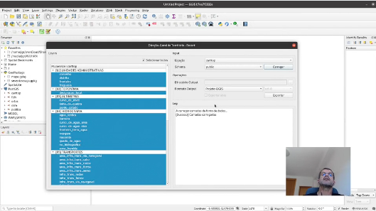
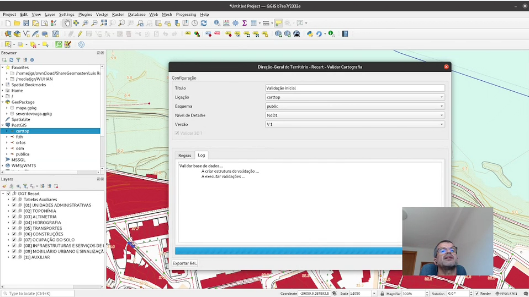
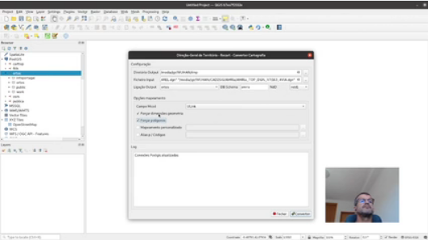
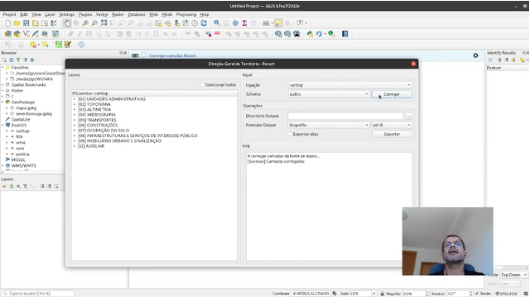

## A aplicação informática recartDGT

A aplicação recartDGT oferece algumas funcionalidades para se tirar o melhor partido do modelo CartTop. O plugin suporta todas as versões do modelo CartTop (v1.1.2, v2.0.1 e v2.0.2) e está em contínuo desenvolvimento. Pode encontrar todas as versões do plugin em https://github.com/dgterritorio/RECART. 

### recartDGT: um módulo QGIS

O módulo recartDGT é uma aplicação informática, que funciona a partir do QGIS, com as seguintes funcionalidades:
- Visualização da Informação Geográfica (adquirida ao abrigo das normas CartTop)
- Validação da Informação Geográfica (adquirida ao abrigo das normas CartTop)
- Conversão da Informação Geográfica (adquirida ao abrigo das normas CartTop) para outros formatos (GPKG, SHP e GeoJSON)
- Conversão da Informação Geográfica antiga (produzida usando o modelo numérico, multicodificada, em DGN/DWG) para CartTop

#### Requisitos

- O módulo deve ser instalado numa versão do QGIS 3.x (lançado em 2018)
- A extensão PostGIS deve ser 3.x (lançado em 2019)
- O servidor PostgreSQL deve estar na versão 11 ou superior (lançado em 2018)

#### Descarregar o plugin recartDGT

O módulo recartDGT está disponível em [recartDGT.zip](https://github.com/dgterritorio/recart-plugin/releases). 

No [repositório do recart](https://github.com/dgterritorio/recart-plugin) está disponível o código fonte. Pode-se e deve-se usar o repositório para reportar questões.

#### Instalar o plugin (interface em Português)

Para instalar o módulo, escolhe-se no menu a opção Módulos → Gerir e instalar módulos...
1. Escolher "Instalar de um ZIP"
2. Escolher o arquivo `recartDGT.zip` em "Ficheiro ZIP:"
3. Proceder à instalação, premindo o botão `Instalar módulo`

O módulo é instalado e fica disponível no menu Módulos.

#### Instalar o plugin (interface em Inglês)

O plugin deve ser instalado numa versão do QGIS 3.x. 

Para instalar o plugin, escolhe-se no menu a opção Plugins → Manage and Install Plugins...
1. Escolher "Install from..."
2. Escolher o arquivo `recartDGT.zip` em "ZIP file:"
3. Proceder à instalação, premindo o botão `Install Plugin`

O plugin é instalado e fica disponível no menu Plugins.

### Utilização do módulo

O módulo tem várias funcionalidades distintas e, por isso, tem desde logo três opções no menu, consoante o trabalho pretendido.

#### Visualização de informação CartTop

Esta opção permite visualizar no QGIS um trabalho guardado em PostgreSQL. O utilizador tem que definir ou escolher a ligação à base de dados e carregar as camadas existentes. Depois escolhe as camadas para acrescentar ao projeto. É criada uma tabela `public.layer_styles` se não existir, com os estilos que serão aplicados às camadas adicionadas ao projeto.

As relações entre as tabelas do modelo CartTop são também adicionadas ao projeto.

[](https://vimeo.com/manage/videos/645190059)

#### Validação da informação em CartTop

Esta opção permite identificar elementos que possam não estar a cumprir as regras definidas nas [especificações técnicas](https://github.com/dgterritorio/recart-carttop-arquivo) de cartografia topográfica publicadas pela Direção Geral do Território até 1 de maio de 2024.

As regras dividem-se em Regras Gerais (RG) e Regras Específicas (RE). Cada uma destas regras são concretizadas em PostgreSQL através de uma ou mais queries.

[](https://vimeo.com/manage/videos/645192295)

Caso julgue que alguma das queries não traduz a regra correspondente de uma forma conveniente, reporte o problema no [repositório](https://github.com/dgterritorio/recart-plugin/issues).
#### Cartografia antiga (multicodificada) para CartTop

Esta opção permite converter cartografia antiga em DGN ou DWG para o novo modelo CartTop. O resultado é uma cartografia em PostgreSQL.

[](https://vimeo.com/manage/videos/645190199)

Caso tenha dificuldades em converter uma cartografia antiga, reporte o problema no [repositório](https://github.com/dgterritorio/recart-plugin/issues). Ao reportar o problema, se possível, anexe a cartografia em causa.

#### CartTop para Shapefile ou Geopackage

Se pretender enviar a cartografia para alguém que não tenha acesso a um servidor de base de dados PostgreSQL, pode empacotar toda a informação num GeoPackage ou em Shapefiles.

[](https://vimeo.com/manage/videos/645189407)

## Conversão de cartografia antiga  para CartTop
### Limitações

Por desenho, a conversão de DGN/DWG deve ser feita para um esquema novo, sem dados. O módulo não tem a capacidade de acrescentar dados a uma conversão anterior. Por essa razão, deve-se escolher um esquema novo para o destino da conversão de MNT para CartTop.

### Opções avançadas

Segue uma breve descrição das opções de conversão de MNT para CartTop.
#### Forçar dimensões da geometria

O CartTop estabelece as geometrias que têm que ser 2D ou 3D. 

Com esta opção ativada, o módulo tenta ajustar a dimensão da geometria original para a adequada em CartTop. Por exemplo, se a geometria tiver que ser 3D, como no caso das curvas de nível, é acrescentada essa dimensão se estiver em falta (com o valor 0).
#### Forçar polígonos

Com esta opção ativada, o módulo tenta correr um algoritmo de **poligonização** de linhas. Por exemplo, se uma construção estiver como linha, tenta-se formar um polígono com as linhas das geometrias originais.


#### Aproveitar apenas a origem das células CAD

Na cartografia DGN, se estiverem a ser utilizados elementos "cell headers", todos os elementos gráficos que compoõem esse "cell header" são convertidos para elementos distintos. 

Ativando a opção **Aproveitar apenas origem células CAD** só é criado um elemento do tipo POINT para cada "cell header". As coordenadas do ponto referem-se à origem (ponto de inserção) do "cell header". 

Esta possibilidade depende de uma versão do GDAL >= 3.5. Pode-se usar uma versão compilada, que inclua o [PR#5664](https://github.com/OSGeo/gdal/pull/5664).

#### Associar códigos desconhecidos a códigos existentes

Na conversão de cartografia, podem surgir códigos nos DGN/DWG desconhecidos. 

Os códigos desconhecidos podem ser tratados de duas formas:
1. A forma mais complexa consiste em acrescentar novos mapeamentos para esses códigos desconhecidos, há semelhança dos muitos mapeamentos existentes. Para tal, é preciso editar o `plugin/convert/mapping.py`.
2. A forma alternativa consiste em mapear os códigos desconhecidos em códigos conhecidos. Isso faz-se criando um ficheiro de __alias p/ códigos__. Esse ficheiro tem que ser escolhido na correspondente opção no plugin.

##### Alias p/ Códigos

É um ficheiro com pares: __código desconhecido__ x __código conhecido__. Exemplo fictício:

```json
{
    "04060704-T_IGREJA": "04060704",
    (...)
}
```

No caso ilustrado, sempre que o multicódigo `04060704-T_IGREJA` apareça, é substituído pelo multicódigo `04060704`.

Para ajudar a identificar os multicódigos presentes num arquivo que se pretende converter, pode-se usar a ferramenta `create_map.py`. Exemplo de invocação:
```bash
python3 create_map.py -f 29_2_31MNT2K.dwg -a Layer
```
É gerado um arquivo `map.json` com todos os multicódigos presentes em `29_2_31MNT2K.dwg`. Deve ser posteriormente editado manualmente.
