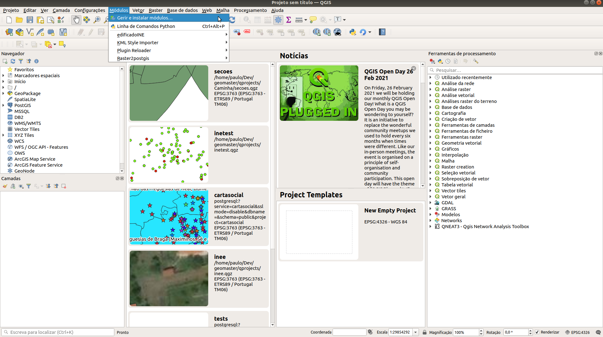
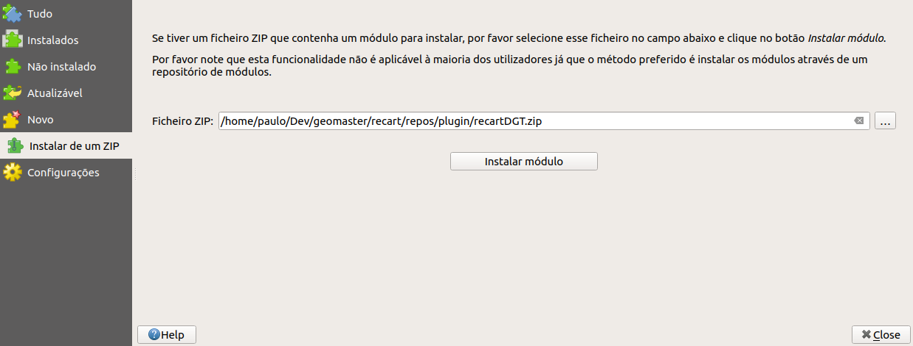
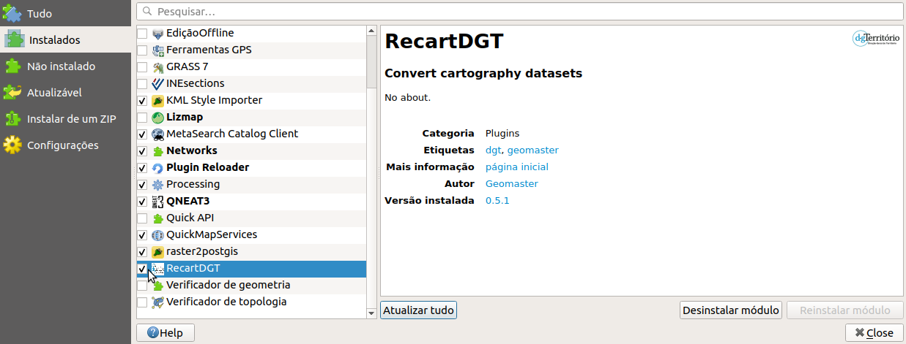
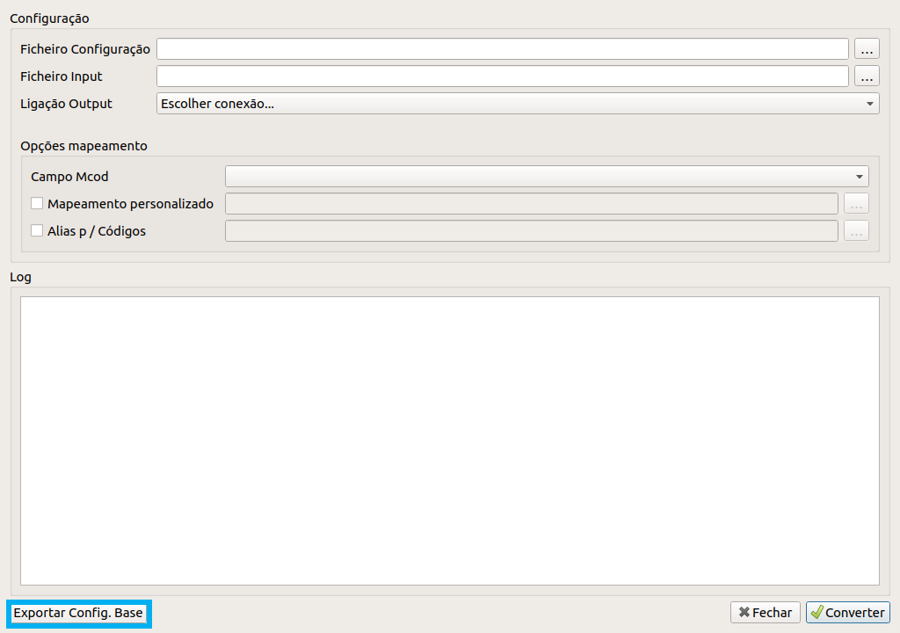
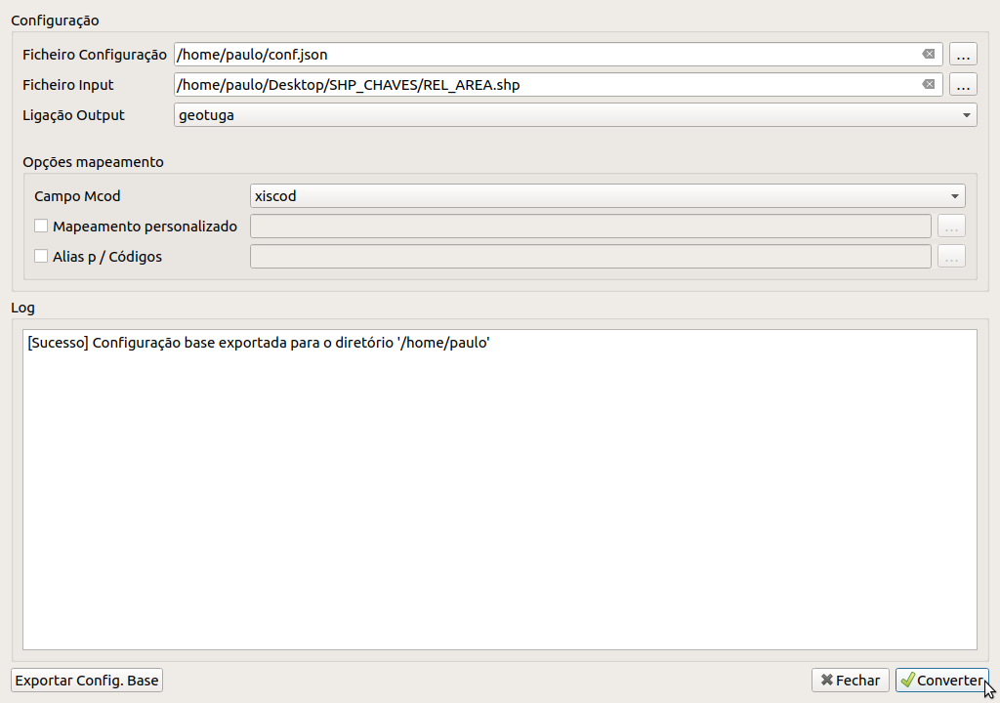
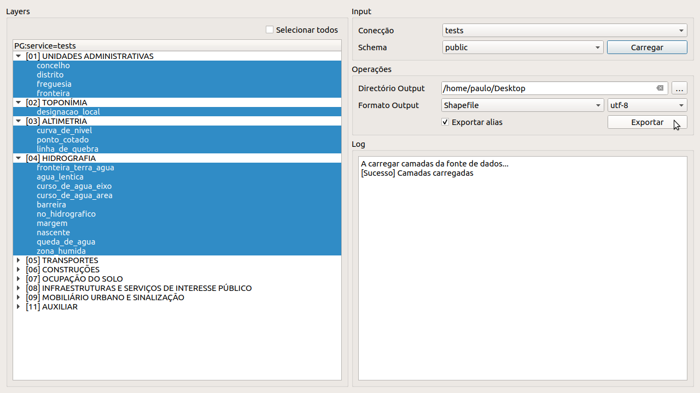

# Guia

O plugin para a importação e conversão de cartografia encontra-se disponível no Gitlab. Devemos começar por descarregar o zip com o plugin: [recartDGT.zip](https://github.com/dgterritorio/recart-plugin/releases).

Depois vamos abrir o QGIS e selecionar o menu 'Módulos'>'Gerir e instalar módulos...'

Na janela seguinte selecionamos 'Instalar de um ZIP', configuramos o caminho para o ficheiro `.zip` do plugin e carregamos no botão 'Instalar módulo'.

Após a instalação é necessário ativar o plugin, para isso precisamos de voltar ao menu 'Módulos'>'Gerir e instalar módulos...', selecionar 'Instalados' e garantir que o plugin `RecartDGT` se encontra selecionado.

## Converter cartografia antiga para PostgreSQL segundo as novas especificações

Para converter um ficheiro multi-código para as novas especificações devemos selecionar o menu 'Módulos'>'RecartDGT'>'Converter'.

Neste novo diálogo utilizamos a opção 'Exportar Config. Base', de maneira a criar a configuração base para a conversão (locale, ndd, schema, etc.)

Juntamente com este ficheiro, indicamos no diálogo do plugin as restantes configurações necessárias à execução da conversão:

* Ficheiro a converter
* Ligação à base de dados PostgreSQL para o output
* Atributo no ficheiro original que contém o código do objeto na cartografia antiga

Com esta configuração é possível proceder à conversão da cartografia através do botão 'Converter'.

## Importar Cartografia Cartop PostgreSQL para outros formatos (GPKG, SHP, ...)

Para exportar cartografia PostgreSQL segundo as novas especificações devemos selecionar o menu 'Módulos'>'RecartDGT'>'Importar'.

No seguinte diálogo devemos começar por selecionar a conexão à base de dados PostgreSQL onde se encontra a nossa cartografia. De seguida escolhemos o schema correspondente à cartografia e clicamos no botão 'Carregar'.

A lista de objetos detetados na base de dados configurada é preenchida no lado esquerdo. Após selecionarmos os objetos que pretendemos exportar, e segundo a configuração do 'Diretório de Output' e do 'Formato Output', podemos carregar no botão 'Exportar' para proceder à operação.

