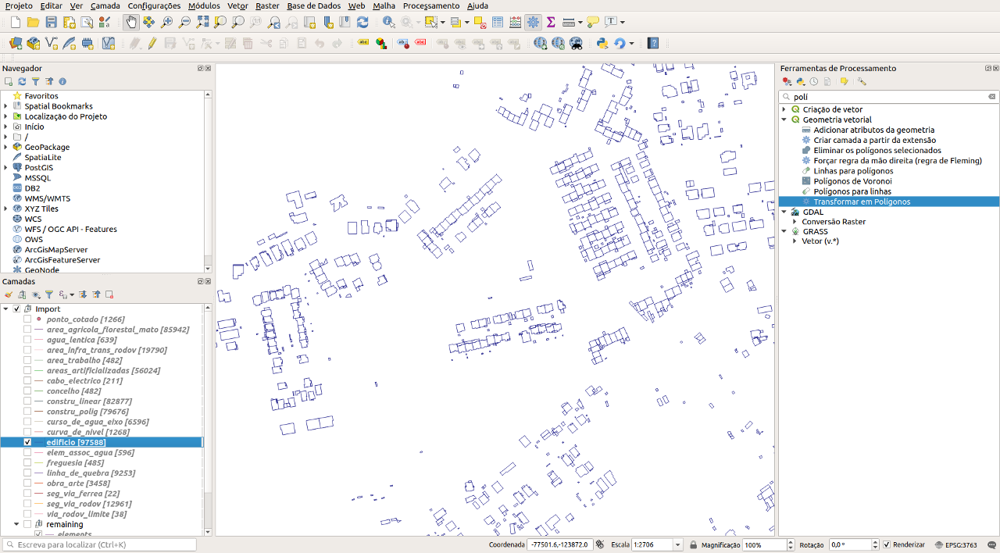
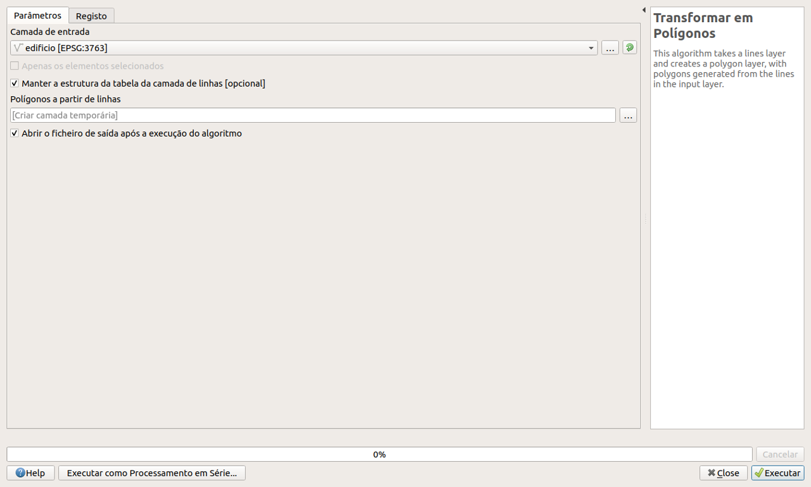
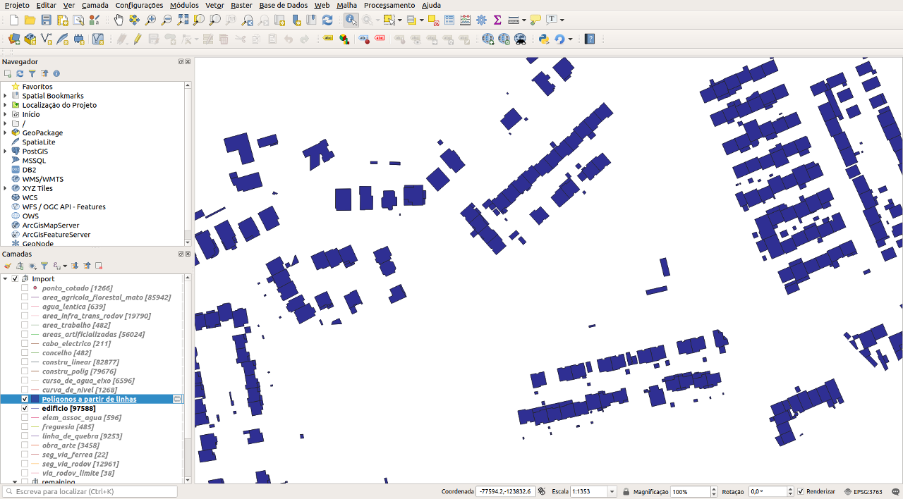

# Importador cartografia para o novo modelo RECART

Esta ferramenta tem como objectivo a conversão de informação geográfica cartográfica existente no modelo multi-codificado para o novo modelo **RECART**.

No final do processo são obtidos ficheiros `ddl` em `sql` para a implementação de uma base de dados **PostgreSQL + PostGIS** compatível com as especificações do novo modelo.

## Requisitos

A execução desta ferramenta necessita que os seguintes requisitos sejam preenchidos:

* Python3 instalado
* GDAL compilado a partir do código-fonte com *patch* para obter *User Data Linkages* (necessário para suportar ficheiros .dgn)

### DGN User Data Linkages

_(Para versões do [GDAL >= v3.3.0](https://github.com/OSGeo/gdal/blob/v3.3.0/gdal/NEWS) este patch não é necessário uma vez que o código para ler *User Data Linkages* foi integrado no GDAL)_

Para correr esta ferramenta com suporte a ficheiros no formato `dgn` é necessário aplicar primeiro um *patch* ao GDAL de maneira a ser possível obter os dados de *User Data Linkages* definidos nos ficheiros dgn. O patch experimental implementado encontra-se disponível neste repositório em `util/ogrdgnpatch.diff`.

Após a aplicação este patch o driver DGN do GDAL aceita uma nova variável, `DGN_ULINK_TYPE`, que vai permitir obter *User Data Linkages*.

    $ sudo apt install python-dev python3-dev python3-numpy
    $ git clone https://github.com/OSGeo/gdal
    $ cd gdal
    $ wget https://gitlab.com/geomaster/dgt-recart/-/raw/master/tools/gmcc/util/ogrdgnpatch.diff
    $ git apply ogrdgnpatch.diff
    $ cd gdal
    $ ./autogen.sh
    $ CPPFLAGS=-DGDAL_LIBJPEG_LARGEST_MEM_ALLOC=5242880000 ./configure --without-libtool --with-python=python3 --with-proj=/usr/local --with-pg=yes

    $ make -j6
    $ sudo make install
    $ sudo ldconfig

    $ cd swig/python
    $ python3 setup.py build
    $ sudo python3 setup.py install

Este *patch* também afeta as ferramentas base do GDAL como o `ogr2ogr`:

    DGN_ULINK_TYPE=6549 PGCLIENTENCODING=LATIN1 ogr2ogr -f PostgreSQL PG:"host=<host> user=<user> dbname=<database> password=<password>" 454_1_10k_MNT.dgn

## Suporte

De momento a ferramenta suporta a conversão de ficheiros de cartografia multi-codificada nos seguintes formatos:

* Shapefile ( .shp )
* DGN V7 ( .dgn )
* DGN V8 ( .dgn ) - _necessário GDAL compilado com ODA libraries_
* DWG ( .dwg )

## Utilização

A execução desta ferramenta tem como requerimento a definição de dois conjuntos de ficheiros:

1. definição de objectos do **RECART**

    * *disponibilizados no directório 'base' os ficheiros relativos à versão 1.1*
    * *fonte da DGT disponível no seguinte [repositório](https://github.com/dgterritorio/RECART)*

2. definição das operações de mapeamento

    * *disponibilizados no directório 'mapping' um subconjunto dos mapeamentos possíveis*

Depois de definir directórios com os ficheiros necessários é possível correr o processo de conversão. Para iniciar esse processo é executado o script `gm_cart_import`

    ./gm_cart_import.py -m ./mapping -i ./exemplos/Setubal/vetor

A ferramenta de importação `gm_cart_import` aceita os seguintes argumentos:

    usage: gm_cart_import.py [-h] [-b BASE] -m MAPPING -i INPUT [-t TIPO]

    Importador de cartografia para o modelo RECART

    mandatory arguments:
    -m MAPPING, --mapping MAPPING  directório com ficheiros de mapeamento
    -i INPUT, --input INPUT        directório com ficheiros para importação

    optional arguments:
    -h, --help                            show this help message and exit
    -b BASE, --base BASE                  directório com ficheiros de objectos RECART
    -t TIPO, --tipo TIPO                  identificador do tipo de user link no dgn
    -cf CAMPO_COD, --campo_cod CAMPO_COD  campo com multi-código

Os argumentos `BASE`, `TIPO`, e `CAMPO_COD` são opcionais e se não forem fornecidos têm os respectivos valores de './base', '6549', e 'ulink' definidos por defeito.

### Ficheiros de mapeamento

Os ficheiros de mapeamento são um ponto fulcral do processo da ferramenta `gm_cart_import`. É a partir destes ficheiros que são definidas as operações que nos permitem importar os dados para o novo modelo.

Os ficheiros de mapeamento são fornecidos em formato `json` e têm como nome o inteiro representativo do código relativo à entidade do modelo anterior que está a ser mapeada. A estrutura do ficheiro tem de incluir um array de mapeamentos onde é definida a tabela e os campos que os elementos deste código vão preencher no novo modelo.

Na pasta `util` deste repositório é fornecida uma ferramenta que extrai os mapeamentos necessários para importar um dado dataset nos formatos suportados.

    ./mcod_parse.py -d ../exemplos/SHP_CHAVES/ -cf xiscod

Esta ferramenta de parsing aceita os seguintes argumentos:

    usage: mcod_parse.py [-h] [-f FICHEIRO] [-d DIR] [-cf CAMPO_COD]

    optional arguments:
    -h, --help                            show this help message and exit
    -f FICHEIRO, --ficheiro FICHEIRO      ficheiro a processar
    -d DIR, --dir DIR                     directório com ficheiros a processar
    -cf CAMPO_COD, --campo_cod CAMPO_COD  campo com multi-código

Os ficheiros de mapeamento gerados por esta ferramenta devem ser tomados como base, sendo posteriormente editados de maneira a melhor se definirem as operações necessárias à conversão dos datasets.

As operações suportadas para a definição dos campos no novo modelo são as seguintes:

1. Geométricas

    * `eq` -> *obtem a geometria*
    * `addz` -> *converte a geometria de 2D para 3D através da função `ST_Force3D` do PostGIS*
    * `dropz` -> *obtem a geometria descartando o Z*
    * `getz` -> *obtem apenas o Z de uma geometria*
    * `point_f` -> *obtem apenas o primeiro ponto de uma geometria*

2. Não-Geométricas

    * `set` -> *atribui o valor definido no campo `value` do mapeamento*
    * `dset` -> *atribui a data definida no campo `value` de acordo com o campo `format` do mapeamento*
    * `dnow` -> *atribui como valor de data a função `now()` do PostgreSQL*

## Pós-processamento

Após obtermos o `ddl` com os dados importados podem ser necessários alguns processamentos de maneira a que o modelo de dados obtidos seja válido de acordo com as especificações do **RECART**

### [1] Fechar / Criar polígonos

Camadas que no anterior modelo se encontravam definidas em conjuntos de linestrings podem ter de ser transformadas em polígonos. A ferramenta de processamento 'Transformar em Polígonos' [PT] / 'Polygonize' [EN] do QGIS pode ser utilizada para executar esta tarefa.

Por exemplo, a camada `edificio` tem definida no novo modelo a geometria como polígonos, no entanto, é possível que o resultado da importação seja um conjunto de linhas.

Correr a ferramenta de processamento 'Polygonize' permite obter a geometria da camada em polígonos.

